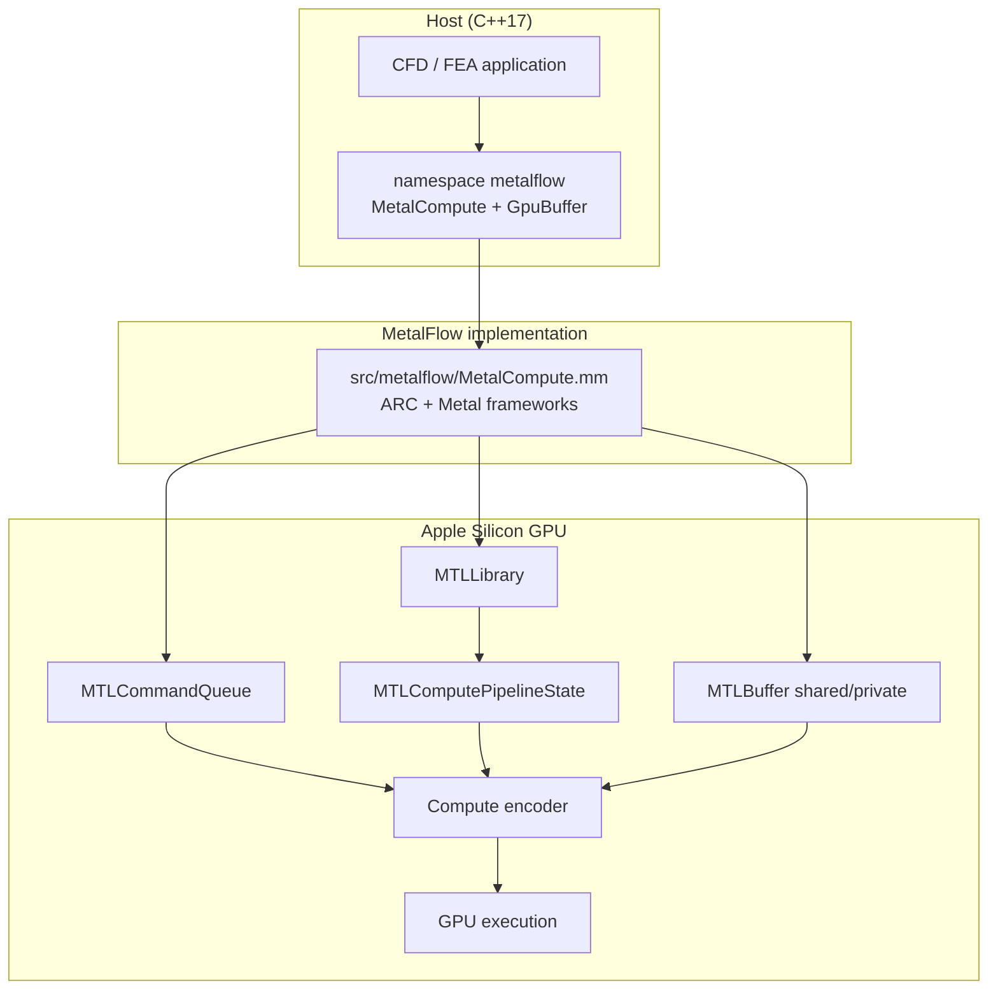
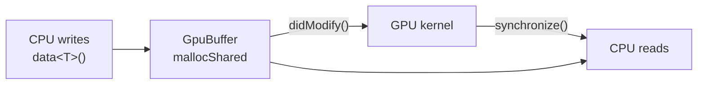
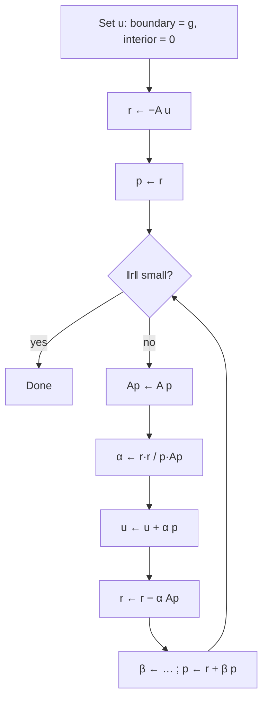

# MetalFlow

**CUDA-style Metal layer for CFD/FEA** on Apple Silicon.

MetalFlow exposes a thin C++ runtime (`metalflow::MetalCompute`,
`metalflow::GpuBuffer`) that mirrors familiar CUDA patterns while targeting
the Apple GPU via Metal — without writing Objective-C++ in application code.

| | |
|--|--|
| Product | **MetalFlow** |
| Namespace | `metalflow` |
| Language | C++17 + Objective-C++ (`.mm`) |
| GPU API | Metal compute |
| Platform | macOS (Apple Silicon recommended) |
| Build | CMake ≥ 3.20 |

```cpp
#include <metalflow/metalflow.hpp>
using namespace metalflow;

MetalCompute gpu;
gpu.compileSource(msl);
GpuBuffer x = gpu.mallocShared(n * sizeof(float));
// ...
gpu.setKernel("saxpy");
gpu.launch(n);
gpu.synchronize();
```

---

## Table of contents

1. [Features](#features)
2. [Repository layout](#repository-layout)
3. [Architecture](#architecture)
4. [Quick start](#quick-start)
5. [API overview](#api-overview)
6. [CUDA ↔ MetalFlow mapping](#cuda--metalflow-mapping)
7. [Laplace solver](#laplace-solver)
8. [Performance notes](#performance-notes)
9. [Doxygen documentation](#doxygen-documentation)

---

## Features

- Namespace `metalflow` with CUDA runtime–like usage
- Unified memory (`mallocShared`) + `didModify()` for CPU→GPU coherency
- Runtime MSL compile (`compileSource`) or load `.metallib`
- 1-D / 2-D kernel launch + `synchronize()`
- Example CFD/FEA kernels (SAXPY, CSR SpMV, Jacobi)
- Full 2-D Laplace solver (Dirichlet BCs, conjugate gradient on GPU)
- Validated on grids up to **8193²** on Apple M2 (24 GB)

---

## Repository layout

```
MetalFlow/   (this repository)
├── include/metalflow/
│   ├── metalflow.hpp         # Umbrella header
│   └── MetalCompute.hpp      # MetalCompute + GpuBuffer
├── src/metalflow/
│   └── MetalCompute.mm       # Metal / ObjC++ implementation
├── shaders/
│   ├── cfd_fea.metal
│   └── laplace.metal
├── examples/
│   ├── demo.cpp
│   └── laplace_solver.cpp
├── docs/                     # Doxygen sources
├── CMakeLists.txt
└── README.md
```

---

## Architecture

### System overview



### Typical kernel launch sequence

```mermaid
sequenceDiagram
    participant App as Application
    participant MC as metalflow::MetalCompute
    participant MTL as Metal GPU

    App->>MC: MetalCompute()
    MC->>MTL: MTLCreateSystemDefaultDevice
    App->>MC: compileSource(msl) / loadLibrary(path)
    App->>MC: mallocShared(bytes)
    App->>App: fill via data&lt;T&gt;() + didModify()
    App->>MC: setKernel / setBuffer / setValue
    App->>MC: launch / launch2D
    MC->>MTL: encode + commit
    App->>MC: synchronize()
    MC->>MTL: waitUntilCompleted
```

### Memory model (Apple Silicon UMA)



---

## Quick start

```bash
cmake -B build -DCMAKE_BUILD_TYPE=Release
cmake --build build

./build/metalflow_demo
./build/laplace_solver ./build/shaders/laplace.metal 10 1e-8 0
```

| Argument | Meaning |
|----------|---------|
| `p` | Grid level: 10→1025² … 13→8193², 14→16385² |
| `tol` | CG relative residual tolerance |
| `exact_id` | `0` = x²−y², `1` = sinh(πx)sin(πy)/sinh(π) |

---

## API overview

```cpp
#include <metalflow/metalflow.hpp>
using namespace metalflow;

MetalCompute gpu;
gpu.compileSource(metalSource);

GpuBuffer x = gpu.mallocShared(n * sizeof(float));
GpuBuffer y = gpu.mallocShared(n * sizeof(float));
x.didModify();
y.didModify();

gpu.setKernel("saxpy");
gpu.setBuffer(x, 0);
gpu.setBuffer(y, 1);
gpu.setValue(a, 2);
gpu.setValue(n32, 3);
gpu.launch(n);
gpu.synchronize();
```

| Type | Role |
|------|------|
| `metalflow::MetalCompute` | Device, library, pipeline, encode, launch, sync |
| `metalflow::GpuBuffer` | Buffer handle + `data<T>()` / `didModify()` |

---

## CUDA ↔ MetalFlow mapping

| CUDA | MetalFlow (`metalflow::`) |
|------|---------------------------|
| `cudaMalloc` / unified | `mallocShared` / `mallocDevice` |
| `cudaMemcpy` | `memcpyHtoD` / `memcpyDtoH` |
| `cudaFree` | `free` |
| NVRTC / cubin | `compileSource` / `loadLibrary` |
| `<<<grid, block>>>` | `launch` / `launch2D` |
| `cudaDeviceSynchronize` | `synchronize` |
| `__global__` | `kernel void` in `.metal` |

---

## Laplace solver



### Measured timings (Apple M2, 24 GB)

| Grid | CG iters | Wall time | max\|u−exact\| |
|------|----------|-----------|----------------|
| 1025² | ~2100 | ~3.4 s | ~6e-6 |
| 2049² | ~3700 | ~20 s | ~1e-5 |
| 4097² | 7222 | ~100 s | ~3e-5 |
| 8193² | 13884 | **~13.0 min** | ~6e-5 |

---

## Performance notes

1. Prefer **`mallocShared`** on Apple Silicon.
2. Call **`didModify()`** after CPU fills shared buffers.
3. Avoid unnecessary `synchronize()` in hot host loops.
4. CG for 2-D Laplace scales roughly **O(N^{1.5})**.

---

## Doxygen documentation

```bash
cmake --build build --target docs
open docs/html/index.html
```

Documents the `metalflow` namespace, classes, call graphs, and architecture
pages (Graphviz flowcharts).

---

## License

MetalFlow is released under the [MIT License](LICENSE).
